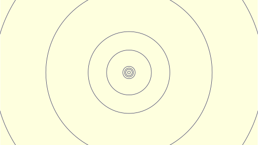

# Wallpapers

This is a collections of wallpapers I made. Some have light and dark variants, some are entirely dynamic.
I provide metadata files for Gnome and KDE, feel free to create a pull request to add more.

Here is an explanation on what the types mean:

<dl>
    <dt>Static
        <dd>A single image that doesn't change at all.</dd>
    </dt>
    <dt>Theme
        <dd>Two variants for light and dark mode. The previews here change with your system or browser theme. Natively supported by KDE 5.26 and above and Gnome 42 and above.</dd>
    </dt>
    <dt>Dual
        <dd>Changes continuously between different looks.</dd>
    </dt>
</dl>

---

## 🌓 Moons

## 🪐 Solar

